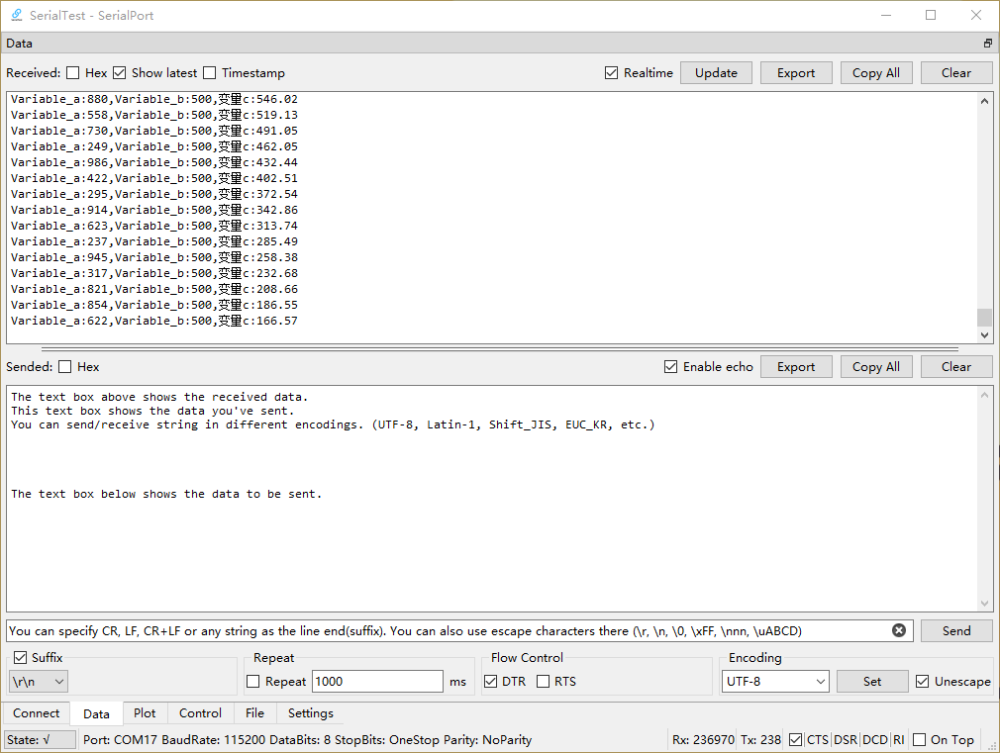
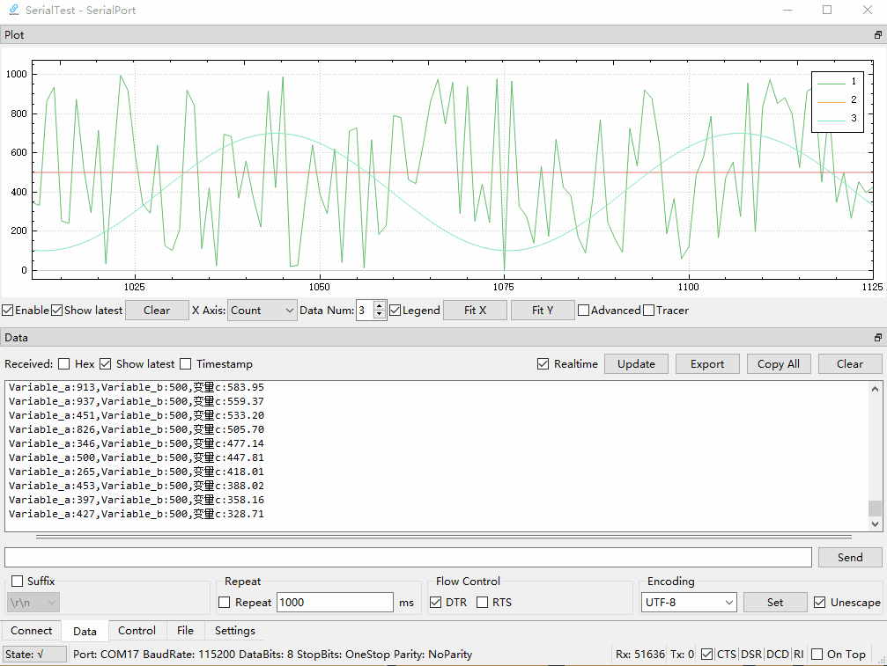
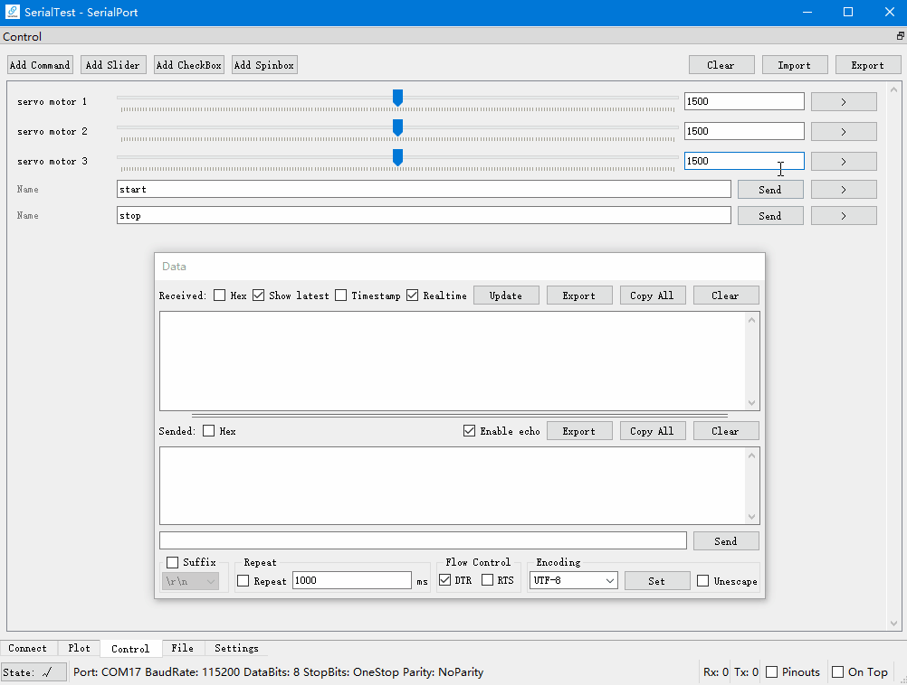
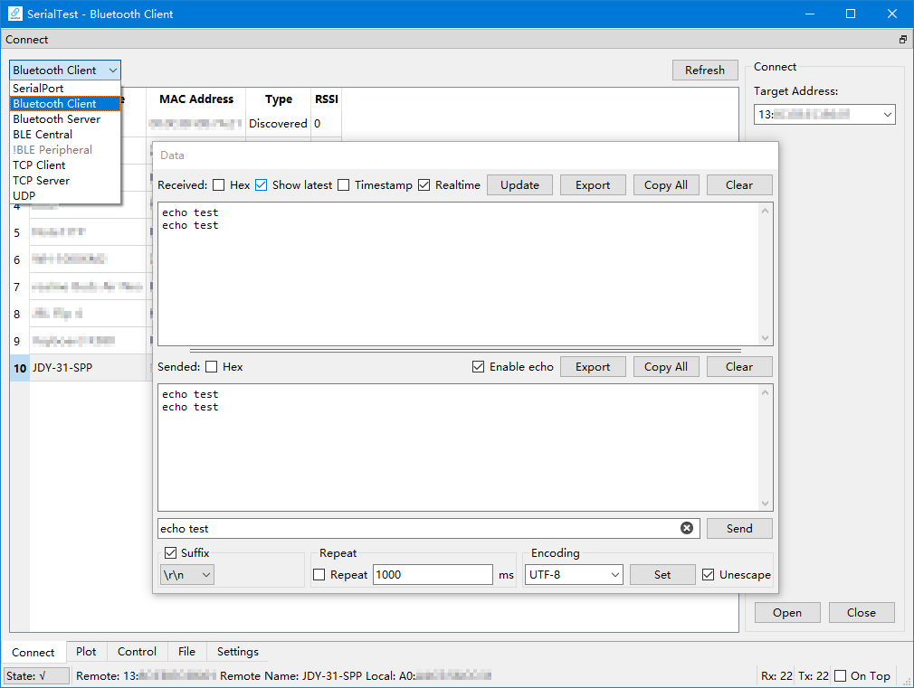
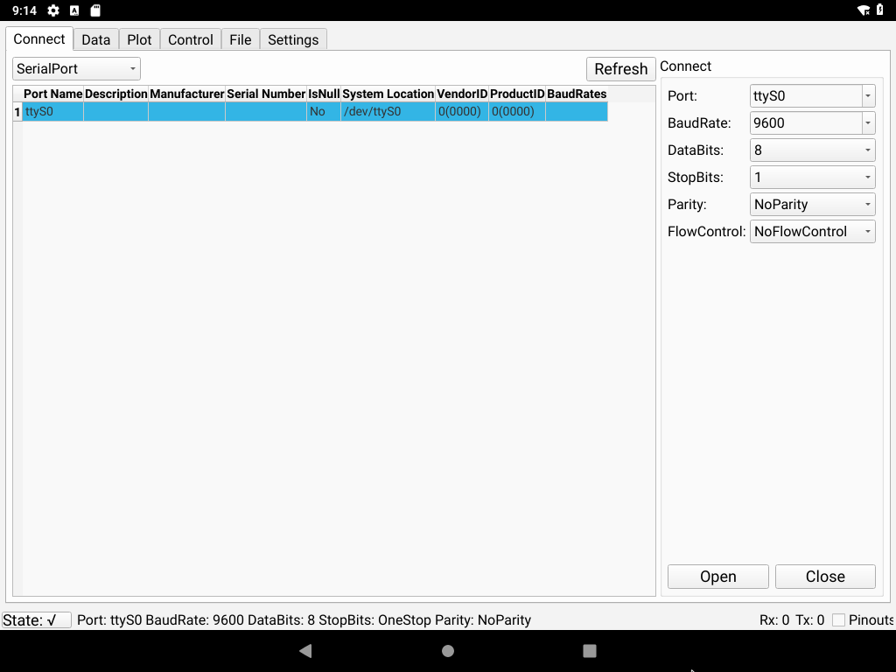
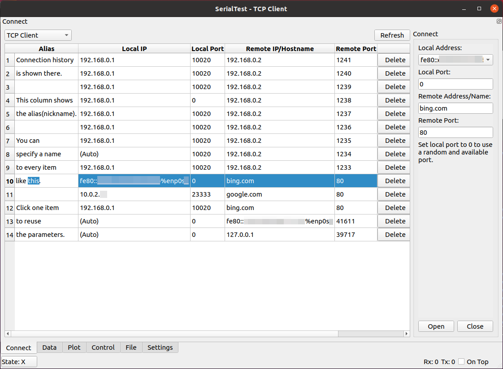
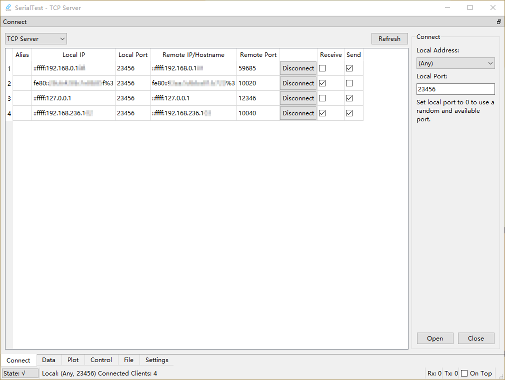

# SerialTest
[](https://github.com/wh201906/SerialTest/releases)  
[](https://sourceforge.net/projects/serialtest/)  
A versatile test tool running on Windows/Linux/Android.  
Works as data transceiver/realtime plotter/shortcut/file transceiver.  
Supports serial port, Bluetooth SPP client/server, Bluetooth LE client, TCP client/server, UDP.  

[中文介绍](doc/README/README_zh_CN.md)  

[](https://f-droid.org/packages/priv.wh201906.serialtest/)  
[](https://flathub.org/apps/io.github.wh201906.serialtest)  

## Features
<details>
<summary>Cross-platform</summary>

+ Runs on Windows/Linux/Android
+ Maybe supports MacOS?

</details>

<details>
<summary>Serial port debugger</summary>

+ Show all available serial ports with parameters. No need to check Device Manager or dmesg  
+ Set baud rate, data bits, stop bits, parity scheme, flow control and change them on the fly  
+ Modify DTR/RTS signals, Show CTS, DSR, DCD, RI(RNG)signals  
+ Save the parameters of the last connection
+ Save connection parameters by port name or device ID then reuse them quickly
+ (Android: support hardware serial port only, like `/dev/ttyXXX`)
+ (Android: [Workaround](https://github.com/wh201906/SerialTest/discussions/11#discussioncomment-5892063) for USB serial devices)

</details>

<details>
<summary>Bluetooth SPP debugger</summary>

+ Supports commonly used Bluetooth modules(HC-05, HC-06, JDY-34, ...)
+ Supports communication between PC and smartphone
+ Supports client mode and server mode
+ The server can be connected by multiple devices. You can enable/disable the Tx/Rx function of them.
+ Supports multiple local Bluetooth adapters (Experimental)

</details>

<details>
<summary>Bluetooth LE debugger</summary>

+ Show all services(primary and included services), characteristics and descriptors of connected device
+ Specify different service for Rx/Tx

</details>

<details>
<summary>TCP</summary>

+ Supports IPv4/IPv6
+ Client：Supports spceifying local address and port
+ Client：The remote address can be a IP address or a website
+ Client：Supports storing connection parameters with user specified name then reuse them quickly
+ Server：Supports listening on all NICs or specified NIC
+ Server：The server can be connected by multiple devices. You can enable/disable the Tx/Rx function of them.

</details>

<details>
<summary>UDP</summary>

+ Supports IPv4/IPv6
+ Supports listening on all NICs or specified NIC
+ Supports storing connection parameters with user specified name then reuse them quickly
+ Change remote address and port on the fly

</details>

<details>
<summary>High performance</summary>

+ Fast response：UI update is separated from Data reception. Disable "Realtime" option in "data" tab for higher speed  
+ Fast response：Time-consuming works run in dedicated threads
+ Low memory cost：Received bytes to memory consumption is about 1:1, if the plot and "Realtime" option are disabled.

</details>

<details>
<summary>Data panel</summary>

+ Show data in hexadecimal
+ Show timestamp of received data
+ Export raw data or selected text
+ Add suffix behind each sending(\r, \r\n, string, hex data)
+ Repeat
+ Rich encoding support  
(UTF8/16/32, GB2312/GB18030, BIG5, KOI8-R, Shift_JIS, EUC-KR, [......](https://doc.qt.io/qt-5/qtextcodec.html#details) )
+ Unescape user input  
（\r, \n, \t, \0, \123, \xFF, \uABCD, ...）
+ Enable/disable echo
+ Show sended/received data only

</details>

<details>
<summary>Realtime plotter</summary>

+ Human-readable data format
+ Drag or scroll the canvas by mouse
+ Drag or scroll the canvas on touchscreen
+ Showing the latest data or holding on
+ Show up to 99 graphs
+ Multiple X-axis mode
+ Legends with customizable name and color
+ Show/hide graphs
+ Clear the canvas by specified data or "Clear" button
+ [Demos of STM32/Arduino/STC8](demo/README.md)

</details>

<details>
<summary>Controll(shortcut) panel</summary>

+ Send spedified data by one click
+ Send a number quickly by slider
+ Send data in hexadecimal
+ Unescaping support
+ Add prefix/suffix
+ Import/Export the whole panel

</details>

<details>
<summary>File transceiver</summary>

+ Calculate CRC32 checksum quickly
+ Send with throttle
+ Stop receiving after specified number of bytes
+ CRC32 and file IO are handled in separated threads for better performance

</details>

<details>
<summary>Handy UI</summary>

+ Show multiple panels with your preferred layout on a single window
+ Show panel as separated windows
+ PC: Stays on top
+ PC: Opacity
+ PC: Start multiple instances with different modes, which are shown on the title bar
+ Check connection parameters and disconnect/reconnect on status bar
+ Customize font
+ Select language
+ Change theme(dark theme)

</details>

<details>
<summary>Portable</summary>

+ The app generates one single config file only
+ Never touchs Windows Registry
+ Use config file in current working directory or system default config directory
+ Export/Import/Clear config
+ Clear history 
+ Set maximum history count

</details>

<details>
<summary>Supports Android</summary>

+ Small screen support: Force landscape mode
+ Small screen support: Show sended/received data only
+ Small screen support: Full screen mode
+ Drag/Scale gesture support on Plotter
+ Share text to SerialTest then send it

</details>

## Previews
| Data Panel | Plotter&Data(GIF) | Control Panel(GIF) | Serial Port, Dark Theme |  
| --- | --- | --- | --- |  
|  |  |  |  |  

| Bluetooth, Windows | Serial Port, Android | TCP Client, Linux | TCP Server |  
| --- | --- | --- | --- |  
|  |  |  |  |  

[more previews](doc/previews/previews.md)  

## Tutorials[WIP]
[1.Connect](doc/tutorials/connect/connect.md)  
[2.Send&Receive Data](doc/tutorials/data/data.md)  
[3.Plot](doc/tutorials/plot/plot_zh_CN.md)  

## Demos
You can write programs on MCU according to the demos in the [demo/](https://github.com/wh201906/SerialTest/tree/master/demo) folder  
[Demo README](demo/README.md)  

## Binaries for Windows and Android
You can download pre-built binaries and Android APK in [release](https://github.com/wh201906/SerialTest/releases) page.  

You can also download them in SourceForge  
[](https://sourceforge.net/projects/serialtest/files/latest/download)  

The Android app is available on [F-Droid](https://f-droid.org/packages/priv.wh201906.serialtest/) as well.  
[](https://f-droid.org/packages/priv.wh201906.serialtest/)  

## Build on Linux
### 1. Install depencencies
```bash
sudo apt-get update
# sudo apt-get install git build-essential
sudo apt-get install qt5-default libqt5serialport5-dev qtconnectivity5-dev 
```
### 2. Get the source code
```bash
cd ~
git clone https://github.com/wh201906/SerialTest.git --depth=1
cd SerialTest
mkdir build && cd build
```

### 3. Choose how to import QCustomplot 
#### Use QCustomPlot source file（recommended）  
You need to [download](https://www.qcustomplot.com/release/2.1.1/QCustomPlot-source.tar.gz) QCustomPlot archive, extract the qcustomplot.cpp and qcustomplot.h in the /src folder(replace the existing qcustomplot.h), then build.  
```bash
wget https://www.qcustomplot.com/release/2.1.1/QCustomPlot-source.tar.gz
tar -xzf QCustomPlot-source.tar.gz
cp qcustomplot-source/qcustomplot.* ../src
```

#### Use QCustomPlot library  
If the qcustomplot.cpp doesn't exist in the src/ folder, the qmake will try to find the library file(xxx.so/xxx.dll) in the building directory(where you call the qmake command) and the default library directory.  
### 4. Build and run
```bash
qmake ../src
make -j4 && make clean
./SerialTest 
```

## Install from the Linux software repository

### Flathub
```bash
flatpak install flathub io.github.wh201906.serialtest
# run this app
flatpak run io.github.wh201906.serialtest
```

### Arch Linux
```bash
# Install the release
yay -S serialtest

# Install the development version
yay -S serialtest-git
```

## Change Log
[Change Log](CHANGELOG.md)
